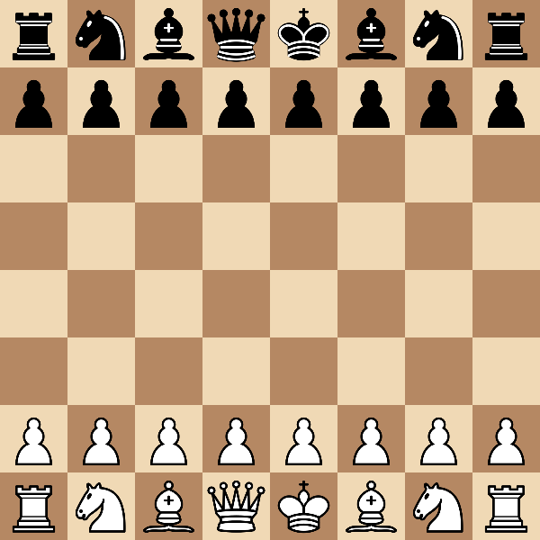

# Chess CV

Point a webcam at a real chess board and get a live digital game record: every
square is classified by a CNN, the position is reconstructed as
[FEN](https://en.wikipedia.org/wiki/Forsyth%E2%80%93Edwards_Notation), moves are
detected and validated against the rules of chess, and the finished game is
saved as a PGN you can drop straight into lichess for engine analysis.

<p align="center">
  
</p>

## Features

- **Square classification** — a ResNet18 fine-tuned on top-down photos of a real
  set classifies all 13 square states (6 piece types × 2 colors + empty) at
  **99.2% validation accuracy**.
- **Live game tracking** — board readouts are matched against the *legal moves*
  of the current position (not naive square-diffing), so captures, castling and
  promotions are detected correctly, and impossible readouts (camera noise,
  a hand over the board) are rejected instead of corrupting the game.
- **Temporal majority voting** — each square is voted over its last 5 readouts,
  so a single bad frame loses the vote. Combined with batched inference
  (all 64 squares in one forward pass, ~16× faster than per-square calls),
  the board re-reads every 0.4 seconds.
- **FEN + PGN output** — the position is printed as FEN after every move; the
  full game auto-saves as a timestamped `.pgn` on exit. Paste it into
  [lichess.org/paste](https://lichess.org/paste) for full engine analysis.
- **Auto-calibration** — the starting position contains all 13 classes, so the
  app captures it once per game as 64 perfectly labeled training images of
  *your* set under *your* lighting. Adapting the model to a new chess set is
  one keypress + retrain.

## How it works

```
webcam frame ─→ click 4 corners ─→ perspective warp (1000×1000)
            ─→ split into 64 squares ─→ ResNet18 (one batched pass)
            ─→ majority vote per square ─→ FEN placement
            ─→ GameTracker: match readout against legal moves ─→ SAN + PGN
```

## Setup

Requires Python 3.11+ with:

```bash
pip install torch torchvision opencv-python python-chess numpy
```

Trained weights are included (`models/weights.pth`), as are the
[cburnett](https://github.com/lichess-org/lila/tree/master/public/piece/cburnett)
piece graphics in `assets/`.

## Usage

### Live mode (webcam)

```bash
python3 live_main.py
```

1. Click the 4 board corners — **top-left from white's perspective first**,
   then clockwise (white at the bottom).
2. Play. Moves print as SAN + FEN as they're detected; the digital board
   window mirrors the physical one.
3. Keys: `c` capture calibration data (board must show the starting
   position) · `r` reset corners · `q` quit and save the PGN to `games/`.

> Tip: `WEBCAM_ID` accepts a video file path instead of a camera index —
> record a game once and replay it for testing.

### Static image mode

```bash
python3 main.py        # uses imgs/test2.JPG by default
```

Click 4 corners, press `p` to predict and print the FEN, `d` for a debug
render of the starting position, `q` to quit.

### Training

```bash
python3 train.py
```

Trains on `dataset_v2/` with a stratified 80/20 validation split, heavy
augmentation (rotation/translation/scale/perspective/lighting) and weighted
sampling for class imbalance. Saves the best-validation-accuracy weights to
`models/weights.pth`. To fold in auto-calibration captures first:
`cp calibration_data/<class>/* dataset_v2/<class>/` for each class.

### Tests

```bash
python3 test_board_state.py
```

Covers FEN conversion, move detection (captures, castling), noise rejection,
new-game detection, and PGN round-tripping — no camera or model needed.

## Project structure

| Path | What it is |
|---|---|
| `live_main.py` | Live webcam mode: voting, move tracking, PGN saving, calibration |
| `main.py` | Static image mode: photo → FEN |
| `train.py` | Training pipeline |
| `board_state.py` | FEN conversion + `GameTracker` (python-chess) |
| `board_utils.py` | Shared warp/split/drawing helpers |
| `calibration.py` | Labeled data capture from the starting position |
| `models/square_classifier.py` | Model definition + single/batched prediction |
| `models/weights.pth` | Trained weights (99.2% val accuracy) |
| `dataset_v2/` | Training data (13 classes, folder per class) |
| `test_board_state.py` | Offline test suite |

A detailed change log with design rationale lives in
[PROJECT_HISTORY.md](PROJECT_HISTORY.md).

## Roadmap

Planned next: two-move resync and takeback detection in the tracker,
auto-orientation (no corner-order requirement), optical-flow corner tracking,
Stockfish integration (live eval + blunder alerts), and automatic board
detection. The full list with context is at the end of
[PROJECT_HISTORY.md](PROJECT_HISTORY.md).

## License

[MIT](LICENSE)
